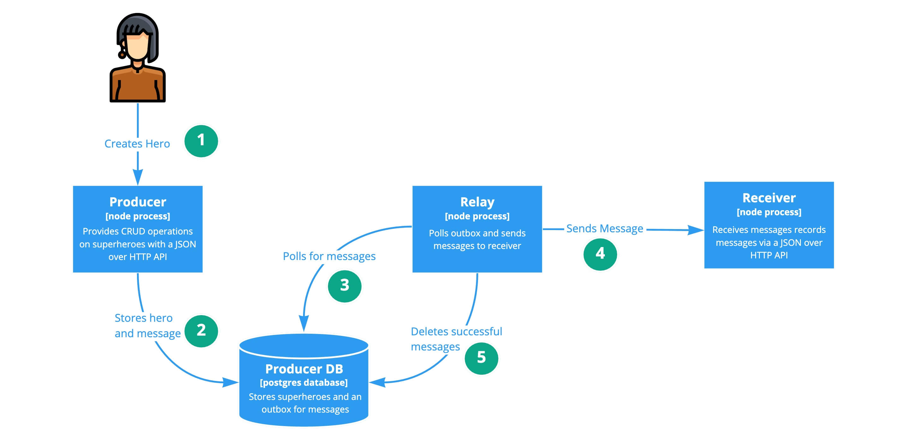

# Transactional Outbox

Chris Richardson - [Microservices.io](https://microservices.io/patterns/data/transactional-outbox.html)

## About

### TLDR;
When a record is inserted a message is written to an outbox table at the same time in a local transaction.  

A relay process sends messages in the outbox table and deletes them when the message is sent successfully.

This means that a record cannot not be added without a corresponding message being queued - ensuring that service crashes or temporary DB issues don't risk the loss of important messages and resulting, state sync bugs.  


### Useful When
You need to update records in you database and reliably notify other services.

Example: An order has been placed. It needs to be recorded and we need a guarantee that fulfillment systems will be notified eventually.


### Considerations
Delivery guarantee is "at least once", as such, consumers of messages should handle the same message being delivered multiple times.
 
This is because the record might not get removed from the outbox after the message is sent (the sending of a message and removal of the message from the db is not atomic). This will result in a duplicate delivery. 

When scaling relays horizontally, a locking system needs to be used to prevent sending the same message many times. 

***

## This Implementation


## Running
```shell script
$ npm i
$ npm run start
```

This launches the docker containers as described in the [docker-compose.yml](docker-compose.yml)
* Producer (http://localhost:3000)
* Receiver (http://localhost:3001)
* Producer Relay
* Producer DB 


## Configuring
All config is done through the environment variables exposed in the [docker-compose.yml](docker-compose.yml) 


## Calling

**POST: http://localhost:3000/hero/create**

```json
{ "name": "Batman" }
```
Creates a hero called batman using the outbox (observe console output).

**GET: http://localhost:3001/messages**

Gets all messages sent to the receiver returned in the order they were received.

**POST: http://localhost:3000/hero/create-sync**

```json
{ "name": "Batman" }
```
Creates a hero called batman and directly calls the receiver without the outbox.

***

## Understanding
Most of the code in this repo is quite boring and serves to make an observable play-pen. 

Let's take a look at the actually interesting bits.

### The Transaction 

Triggered as a result of an API call, [createSuperHero](src/producer/lib/superhero/create.ts) is the place to dig in and observe how the transaction works to ensure an outbound message is queued.

### The Relay 

The entry point to polling process is [startSendingMessages](src/producer/lib/messages/send.ts). 


### Scaling

The relay is setup to support horizontal scaling - eg running many relay instances. In fact you can control this with the `scale` value inside the [docker-compose.yml](docker-compose.yml). 

This is quite important in a high volume system, if we don't process messages in time the outbox will grow and grow. 

With multiple relays running, it is highly likely that (at least) two relays will try to send the same message - resulting in many duplicate message deliveries. 

To prevent this the implementation uses `getNextMessageExclusively` [to temporarily lock messages](src/producer/lib/messages/get.ts) when the relay picks them up to try and send them.

This implementation does not ensure message order - favouring simplified horizontal scaling. 

### Reliability

As ever, predicting and handling non-happy scenarios is where the details lie. Check out [handleFailures](src/producer/lib/messages/send.ts).

This pattern handles a number of failure scenarios pretty well:

| Scenario  | Outcome |
| ------------- | ------------- |
| Crash in between creating hero and queuing message  | Hero not created, message not sent  |
| Receiver unavailable message not sent  | Message will be retried  |
| Relay crashes whilst sending message  | Message is sent when relay recovers  |
| Relay crashes after locking message but before sending  | Lock expires, message is sent when relay recovers  |
| Relay crashes after message is sent but before it is deleted  | Lock expires, message is sent again and then deleted  |

In this implementation a retry mechanism is built in to the process, specifically with a delay before retrying. 

Delays (and exponential back offs, not implemented) can be very useful to prevent bombarding failed or failing services.

### Messages

As this pattern aims to ensure "at least once delivery", messages **must** have an identifier so that the consumer can ignore duplicate messages.

There is nothing preventing an outbox from containing messages originating form multiple events - eg here we have implemented `HERO_CREATED` we could easily extend to `HERO_DELETED` by simply providing a different event id.

Correlation ID's are very useful in debugging issues. In this example our message is correlated to the original request which created the super hero for example, and that correlation id is sent with the message. This allows log tracing to occur across service boundaries.

Small messages are greatly preferable as they are cheaper to store, faster to transmit, and more transports are available to carry them. When designing a message payload consider what data is required for notification - and what data can alternatively be retrieved later if the consumer requires it.

### Undeliverable Messages

In this implementation a message is given a certain number of attempts before it is assumed undeliverable and deleted from the queue silently. 

This is brutally simple and prevents the process from getting or gummed up by bad messages - however think about the needs of your solution. 

What should happen to messages that can't be delivered? Is it ok for them to vanish? The answer is normally *no* and choosing to not handle them can have significant impacts on end users.  

***

## Exploring
### Connecting to the DB
Being able to look inside the producers database would be good - PGadmin4, Postico and Datagrip are all noteworthy tools. 

You'll find the connection details you require in [docker-compose.yml](docker-compose.yml).

Checkout the `Messages`table for messages sat in the outbox.

### Lets Cause Some Chaos

* TODO - a tool to send a steady stream of requests to the producer for both sync and using the outbox
* TODO - make missing / duplicate messages on the receiver observable
* SCENARIO 1 - receiver is offline
* SCENARIO 2 - receiver is intermittently failing
* SCENARIO 3 - receiver is holding open requests until they timeout
* SCENARIO 4 - receiver is experiencing noisy neighbour problems (event loop blocks)
* SCENARIO 5 - receiver is rejecting requests due to client error
* SCENARIO 7 - relay fails and stops processing messages


